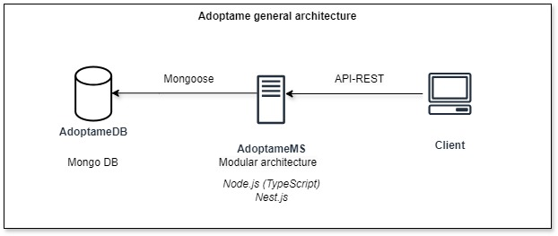
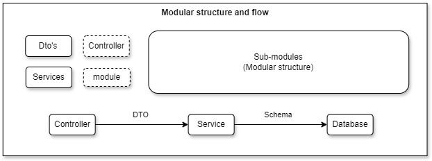
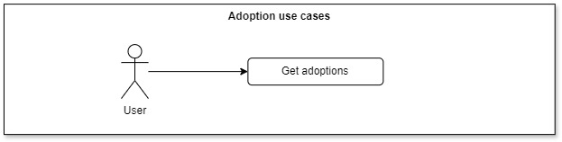

# Adoptame

A simple and user-friendly app that connects people with animals in need of adoption, helping you find and adopt your perfect pet.

<details>
  <summary><b>Demo</b></summary>
<br>

You can try out a demo of the API [here](https://inadequate-nertie-adoptame-df50d4c3.koyeb.app/docs).

To access the demo, use `/auth/login` with the following credentials:
```json
{
  "email": "usuario_1@example.com",
  "password": "ABC#abc#123"
}
```

You can use the Swagger Bearer authentication by clicking `Authorize` to enter the token generated from the `/auth/login` endpoint. Once you have authenticated with the token, you can automatically test all endpoints that the user has access to.

</details>

## Project Setup

<details>
  <summary>See the steps to configure and run the project</summary>
<br>

1. **Install Node.js, Git, and Npm:**

    Download and install **Node.js** (preferably version 22 to ensure compatibility) from the official website: [https://nodejs.org/en](https://nodejs.org/en). Verify the installation by running:

    ```bash
    node --version
    ```

    Download and install **Git** from the official website: [https://git-scm.com](https://git-scm.com). Verify the installation by running:

    ```bash
    git --version
    ```

    **Npm** is installed automatically with Node.js. Verify the installation by running:

    ```bash
    npm --version
    ```

2. **Clone the project and switch to the `develop` branch:**

    Run the following commands to clone the repository and checkout the `develop` branch:

    ```bash
    git clone https://github.com/Adoptame-com/Adoptame-Backend.git
    cd Adoptame-Backend
    git checkout develop
    ```

3. **Install dependencies:**

    Run the following command to install all project dependencies:

    ```bash
    npm install
    ```

4. **Create configuration file:**

    Create a file named `.env.development` in the root of the project with the following content:

    ```bash
    # PORT: Port number on which the application will listen for incoming requests
    PORT=
    # MONGO_URI: Connection string for MongoDB. Includes the database server address, port, and authentication details if required.
    MONGO_URI=
    # JWT_SECRET_KEY: Key used for signing and verifying JSON Web Tokens (JWTs). Ensure this key is strong, unique, and kept confidential.
    JWT_SECRET_KEY=
    ```

5. **Create sample data (Only if you want to use your own database):**

    If you need reset database and set sample data, you can easily do so by running the following command:

    ```bash
    npm run db:reset
    ```

6. **Install VSC extensions (Optional for Visual Studio Code) :**

    You can install the required VS Code extensions by running the following commands:

    ```bash
    code --install-extension dbaeumer.vscode-eslint
    code --install-extension rvest.vs-code-prettier-eslint
    ```

    Alternatively, you can install these extensions `Prettier ESlint` and `ESlint` manually from the VS Code marketplace.

    To ensure that the configurations are applied correctly, restart Visual Studio Code.
<br>

7. **Run the project in development mode:**

    Navigate to the project directory and run the following command to start the project in development mode:

    ```bash
    npm run start:dev
    ```

    This will start the project with the development configuration. 
    
    You can view the documentation at `http://localhost:<PORT>/docs`, where `<PORT>` is the port specified in your `.env.development` file.

</details>

## Architecture

<details>
  <summary>See the architecture</summary>
<br>

<details> 
  <br>
  <summary>General architecture</summary>

  

  The general architecture include a microservice **AdoptameMS** client that interacts with the **Client** through a **RESTful API**. The microservice is built using Node.js (TypeScript) with the Nest.js framework, following best practices for modularity and scalability.

  The **AdoptameMS** communicates with a **AdoptameDB**, a mongo database, using **Mongoose** as the ORM to handle data modeling and interactions.

</details>

<details>
  <br>
  <summary>Structure</summary>

  

  You can see the project's file and directory structure, designed to maintain a modular organization and facilitate code development and maintenance. The concepts are described below.

  - **Git customs**: Husky for managing Git hooks and ensuring code quality before commits.
  - **Workspace customs**: VSCode settings for consistent development environment configuration.
  - **Packages**: Dependencies and libraries managed via `package.json`.
  - **Logs**: Application logging files.
  - **Test**: Contains automated tests for verifying application functionality.
  - **Build**: Build scripts and output directories for compiled code.
  - **General configs**: Configuration files and global settings.
  - **Core module**: The root module of the application.
    - **Common**: Shared utilities and components used across the application.
      - **Statics**: Static files like codes, constants, docs, meesages and paths.
      - **Scripts**: Utility scripts.
      - **Decorators**: Custom decorators used to extend functionality.
      - **Exceptions**: Custom exception classes for error handling.
      - **Functions**: Utility functions and helpers.
      - **Interceptors**: Request and response interceptors for modifying or handling data.
    - **Dto's**: Data Transfer Objects for validating and transforming data.
    - **Services**: Business logic and service layer handling data processing.
    - **Module**: `app.module.ts` - The root module of the application.
    - **Main**: `main.ts` - The entry point of the application, bootstrapping the NestJS app.
    - **Modules**: Specific modules that encapsulate related controllers, services, and DTOs.

  

  You can see the general file and directory structure for submodules and the recommended flow to maintain a modular architecture. The concepts are described below.

  - **Dto's**: Data Transfer Objects for validating and transforming data.
  - **Controller**: Manages incoming requests, processes them, and returns appropriate responses.
  - **Services**: Business logic and service layer handling data processing and interactions with the database.
  - **Module**: `submodule-name.module.ts` - Defines the module configuration, imports necessary components, and sets up dependencies.
  - **Sub-Modules**: Specific sub-modules that encapsulate related controllers, services, and DTOs, allowing for organized and modular code.
  - **Schema**: Defines the data structure and validation rules for MongoDB collections, used for database interactions. It is not part of the submodule structure but is centralized in the specific MongoDB module.

</details>

<details>
  <br>
  <summary>Data Model</summary>

  

  The database features Accounts and adoptions collections, incorporating relations, type, descriptions and constraints.

</details>

<details>
  <br>
  <summary>Use Cases</summary>

  

  The **Account Auth Use Case diagram** illustrates the interactions between an user and the system for managing user auth. The user can perform the following actions:

  - **Login**: Authenticate user on the system.
  - **Signup**: Register user on the system.

  

  The **Adoption Use Case diagram** illustrates the interactions between users and the system for managing adoption data. The user can perform the following actions:

  - **Get adoption**: Allow get all adoptions on the system.

</details>

</details>

## Contribution Guidelines

<details>
  <summary>See Contribution Guidelines</summary>
  <br>

<details>
  <summary>Git Branching Strategy</summary>
  <br>

  The Git branching strategy ensures a structured and predictable workflow, facilitating continuous integration and easy management of releases and fixes. Below are the main branches and their specific purposes in the project:

  #### `main`
  Contains stable, production-ready code. All final releases are made from this branch.

  #### `develop`
  Integration branch for ongoing development. All new features and improvements are merged here before being released.

  #### `deploy`
  Used to prepare and deploy code to staging or production environments. Derived from `develop` or `main`.

  #### `fix/issue-xxxx`
  Dedicated branch for urgent bug fixes. Based on `main`, it’s used to resolve critical issues that need immediate attention.

  #### `feature/issue-xxxx`
  Individual branches for developing new features or resolving specific issues, derived from `develop`. Named according to the related issue number (`issue-xxxx`).

</details>

<details>
  <summary>Conventional Commits</summary>
  <br>

  Use this format for commit messages:

  #### **Type**
  - **`feat`**: New feature
  - **`fix`**: Bug fix
  - **`docs`**: Documentation update
  - **`style`**: Code formatting
  - **`refactor`**: Code change without adding features or fixing bugs
  - **`test`**: Adding or updating tests
  - **`chore`**: Maintenance tasks

  #### **Scope**
  - Optional: Identifies the part of the code affected (e.g., `auth`, `api`, `ui`).

  #### **Content**
  - Brief, imperative summary of the change.

  #### Examples

  - **Feature**: `feat(ui): add dark mode toggle`
  - **Bug Fix**: `fix(api): handle null values`
  - **Docs**: `docs(readme): update setup guide`

</details>

<details>
  <summary>Contribution Guide</summary>
  <br>

  This guide outlines the steps to effectively contribute to the project. By following these instructions, we ensure consistent quality, clear communication, and smooth collaboration among team members.

  ##### 1. Create an Issue
  - **Title**: Clearly describe the issue or feature.
  - **Details**: Add any relevant information or context.

  ##### 2. Branching
  - **From**: Always branch from `develop`.
  - **Branch Name**: Use `feature/issue-xxxx` (replace `xxxx` with the issue number).

  ##### 3. Development
  - **Code**: Implement the changes in your branch.
  - **Commits**: Follow the Conventional Commits guidelines.

  ##### 4. Pull Request
  - **PR Title**: Match the issue title.
  - **Description**: Briefly explain the changes.
  - **Target Branch**: Always target `develop`.

  ##### 5. Assign Reviewers
  - **Reviewers**: Assign at least two team members for review.
  - **Labels**: Add relevant labels (e.g., `bug`, `enhancement`).

  ##### 6. Address Feedback
  - **Revisions**: Make changes based on reviewer feedback.
  - **Final Check**: Ensure all comments are addressed before merging.

  ##### 7. Merge
  - **Approval**: At least one team member must approve the pull request before it can be merged.
  - **Merge**: Once approved, merge the PR into `develop`.
  - **Delete Branch**: Clean up by deleting the feature branch.

</details>

</details>